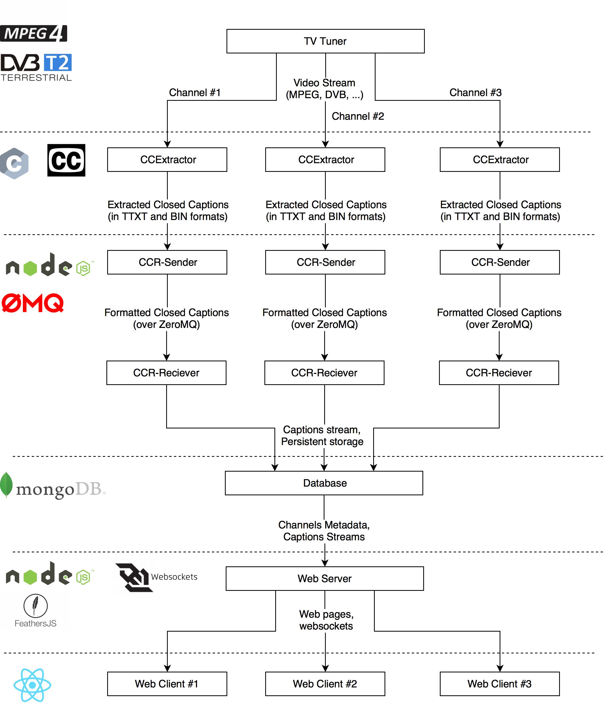

# Real-Time Close Captions repository

## Architecture



## Deployment using Docker

1. Build web pages static content: `cd app && ./build.bash`
2. Build containers: `docker-compose build`
3. Run dontainers: `docker-compose up`

## Deployment using Kubernetes
1. kubectl create -f app-deployment.yaml,app-service.yaml,data-volume-persistentvolumeclaim.yaml,database-deployment.yaml,database-seed-deployment.yaml,database-seed-service.yaml,database-service.yaml,reciever-deployment.yaml,reciever-service.yaml

## Streaming a new channel

1. Specify database url in `./admin/config.json`
2. Create a new channel (with id 'test1' and title 'Test Channel'):
```bash
./admin/ccr-channels-create -i test -i 'Test Channel'
```
4. Install package dependencies
```bash
cd sender && npm i
```
5. Start streaming:
  * Using [CCExtractor](https://github.com/CCExtractor/ccextractor) and real workload:
```bash
./ccr-sender -C <channel_id> -e <ccextractor_path> -u <ccextractor_source> -D <ccr-reciever_url>
```
  * Using ccextractor mock that streams a single file
```bash
./ccr-sender -C test1 -e tests/ccextractor -u dummy_url:port  -D tcp://127.0.0.1:5000
```

